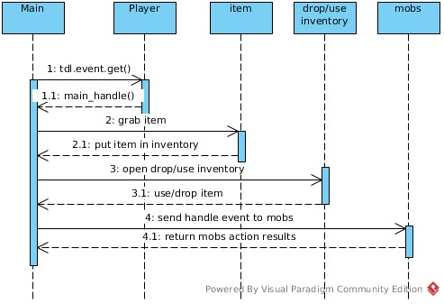

# Roguelike Design Document

## Игровой процесс

Герой просыпается на песчаной арене, кишащей троллями и орками. Он не может ничего вспомнить. Однако в руке он обнаруживает записку: "Спасите меня, я в большой беде по ту сторону стены". Игрок решает во что бы то ни стало помочь незнакомцу и отправляется в путь. Он хочет найти выход из лабиринта. На своем пути ему придется столкнуться со множеством опасностей. Однако он не будет унывать, ему будет придавать сил мысль о помощи попавшему в беду человеку.

P.S.: выход из лабиринта написать не успела.

### Боевая система

Игрок автоматически атакует любое существо, которое находится на клетке, в которую он пытается шагнуть.

Количество урона, которое существо наносит врагу, вычисляется как `сила существа - защита врага`.

### Экипировка

По карте разбросаны предметы, которые может использовать игрок. Эти предметы могут увеличивать характеристики героя: силу, защиту или уровень здоровья. Например, целебное зелье восстанавливает часть здоровья игрока.

Также у игрока есть сумка, в которой он может хранить собранные предметы для дальнейшего использования.

### Экраны

В игре есть два режима: игровой, на котором отображается карта и сам игрок, уровень его здоровья, а также лог игровых событий,
и экран взаимодействия с инвентарем.

## Диаграмма компонентов

Компонентом для запуска игры является компонент `Main`.

Компонент `Graphics` отвечает за отрисовку игрового мира.

Компонент `handle keys` отвечает за распознавание команд пользователя. 

Компонент `reaction on event` меняет состояние игры в зависимости от действий игрока (таких как нанесение урона врагам или использование предметов).

## Диаграмма классов

Класс Entity представляет собой существо из мира игры. Его боевыми действиями управляет класс Fighter. Существо может носить с собой некоторое количество предметов (представленных классом Item) в инвентаре.

Оповещение игрока осуществляется с помощью класса MessageLog, в который записываются сообщения, генерируемые системой в процессе игры.

## Диаграмма последовательностей

На данной диаграме показано взаимодействие системы с основными элементами игровой системами: инвентарь, предметы и мобы.

## Диаграма состояний

Данная диаграмма отображает изменение состояния игры в зависимости от действий игрока (таких как атаки и взаимодействие с предметами).